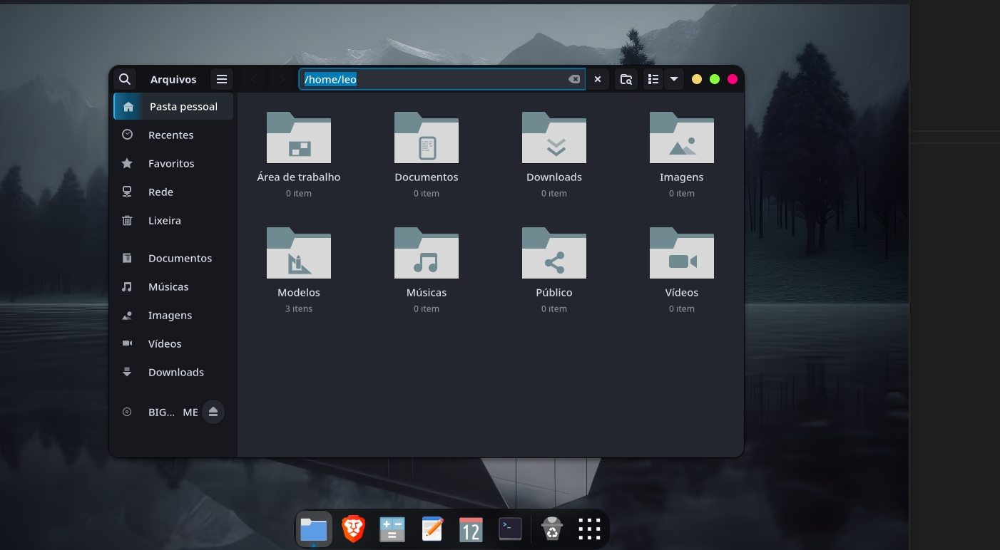

# comm-gnome-theme-andromeda

Andromeda is a sleek and modern GNOME theme that includes:
- A custom GTK theme

This package is designed for Arch Linux and derivatives.

---

### 🎨 Screenshot:

---
## Features

- **Complete Customization**: Updates both GTK3 and GTK4 configurations.
- **Backup Friendly**: Automatically creates backups of existing configurations during installation.

